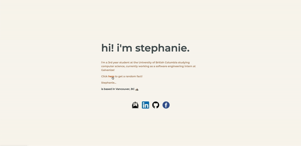
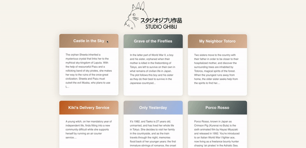

# Intro to Web Debugging Workshop (cmd-f Learn 2021) 🌱

Hello friends! This workshop was presented at cmd-f Learn 2021 - the Youtube recording can be found [here](https://youtu.be/fhxKmcvNSkE) and the full workshop content can be found on Notion [here](https://tinyurl.com/debuggingworkshop) ✨

Sometimes you're building something super cool, you're confident it works, but something looks just a little bit... off? Finding mistakes and debugging issues in your code is a skill that can take time to master, and this workshop will help walk you through some tips and tricks to start debugging a portfolio and Studio Ghibli website!

Building up a base intuition for debugging is a super important skill to have, whether working on a personal project or contributing to a new codebase at an internship! 

## Resources used
- [Studio Ghibli API](https://ghibliapi.herokuapp.com/#section/Studio-Ghibli-API)
- [Studio Ghibli API Tutorial](https://github.com/taniarascia/sandbox/tree/master/ghibli)

## Workshop prerequisites 
- [ ] Install text editor: [VSCode](https://code.visualstudio.com/download) (strongly recommended)! Alternatives are Notepad++, Sublime Text, Atom
- [ ] [VSCode Live Server Plugin](https://marketplace.visualstudio.com/items?itemName=ritwickdey.LiveServer) - this will help you to see live reloads for your static page on your local server!
- [ ] Make sure you have an up-to-date web browser to test code in: Chrome (recommended)! Alternatives are Firefox, Opera, Safari, Edge
- [ ] Clone this Github repository using the command line or Github Desktop (Atlassian has a [great guide](https://docs.github.com/en/github/creating-cloning-and-archiving-repositories/cloning-a-repository) on this)

**Optional, but nice:**
- [ ] Attended nwPlus workshop: [Intro to Web Dev](https://github.com/nwplus/web-dev-intro)
- [ ] Navigate to `debug-me/index.html` and modify the blurb on line 18 to reflect yourself
- [ ] Replace the links inside `index.html` with your social media links
- [ ] Navigate to `debug-me/scripts/script.js` and edit the `facts` array on line 14 with random facts about yourself (you can also play around with the emojis!)

You're all set to begin this workshop! Please head on over to [this Notion page](https://tinyurl.com/debuggingworkshop) to follow along :)

## Final debugged websites 

**Portfolio page**

After fixing some wonky HTML/CSS bugs, you'll see this!

**Studio Ghibli page**

And after fixing the `GET` HTTP request to the Studio Ghibli API and receiving the API response correctly, you should see this!

## More resources
- We have more recorded workshops for you on the [nwPlus Youtube channel](https://www.youtube.com/channel/UCOo5TwIHMn7gRwqjUYXSMJQ) 💕
- [Self-Learning Resources](https://resources.nwplus.io/) Wiki by [nwPlus](https://www.nwplus.io/)
- Mozilla Developer Network (MDN) [documentation](https://developer.mozilla.org/en-US/docs/Learn)
